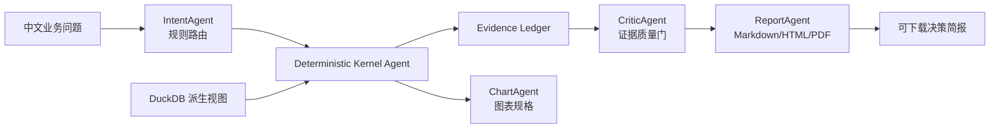

# ChainLens 链见

ChainLens 是一个面向智能制造产业的数据要素应用。它把工商登记、招投标、融资、股权和资质五类公开数据融合起来，回答三个实际问题：

1. 哪些企业有真实经营痕迹，却在融资数据里“看不见”？
2. 哪些资质正在到期，可能让企业错过投标或政策申报？
3. 哪些企业、区域和行业是产业协作网络的关键节点，哪里存在“企业多但交易弱”的空转预警？

它不是让大模型凭空写一份行业报告。数字、排名、筛选和指数全部由确定性 SQL/Python 内核计算；Agent 负责路由、组织证据、选择图表和生成可读报告。没有模型 Key 也能运行，所有结论都能回到证据链。

## 为什么有社会价值

公开数据里，融资记录只覆盖少数企业，招投标和资质记录却能呈现企业的真实经营痕迹。ChainLens 把这些痕迹加工成可核验的线索，帮助园区、银行、担保机构和企业服务部门更早发现“有能力但缺少标签”的中小企业，也帮助企业减少资质漏续期造成的经营损失。

当前本地数据底座包含约 1.76 万家企业、约 59 万条招投标记录。数据不进入 Git，评审或部署人员通过本地 Excel 重建 DuckDB。

## 当前能力

- 融资可见性：OCS 经营性信用分、融资缺口、隐形冠军候选名单
- 资质悬崖：区分年度制度性到期与多年期真实失效，生成未来 12 个月提醒清单
- 产业网络：从同一招投标公告重建供需、协作、竞争关系
- 区域体检：区县产业健康指数、行业空转预警、成立和招投标趋势
- 可审计交付：证据账本、Markdown、HTML、PDF、PNG 图表
- 离线优先：默认使用本地 DuckDB，不依赖 MySQL 或模型 Key

## 快速开始

```powershell
cd G:\chainlens
python -m pip install -r requirements.txt
python scripts\build_warehouse.py --raw-dir G:\text2sql_0705
python scripts\run_pipeline.py
```

运行四个标准问题后，报告在 `data\outputs\acceptance_YYYYMMDD\`。每个场景包含 Markdown、HTML、PDF 和图表。

启动交互页面：

```powershell
streamlit run app\streamlit_app.py
```

## 测试和安全检查

```powershell
python -m pytest -q
python scripts\check_security.py
```

当前验收包含四个真实内核和 Agent 交付链路。没有证据、没有数据或包含敏感配置的结果不会被当成合格报告。

## 架构



详细口径见 [docs/METHODOLOGY.md](docs/METHODOLOGY.md)，竞赛立意见 [docs/COMPETITION_BRIEF.md](docs/COMPETITION_BRIEF.md)，交接入口见 [docs/AGENT_HANDOFF.md](docs/AGENT_HANDOFF.md)。

## 公网部署

当前静态前端已部署到：

<https://gaaiyun.github.io/chainlens/>

API 采用 FastAPI，可部署到 Railway。仓库根目录的 `railway.toml` 已固定启动
命令和 `/health` 健康检查。部署前要先把被 Git 忽略的 DuckDB 数据底座放入
Railway Volume 或受控对象存储；只部署代码不会自动带上真实实验数据。

完整步骤见 [docs/RAILWAY_DEPLOY.md](docs/RAILWAY_DEPLOY.md)。

## 数据和合规边界

原始 Excel、DuckDB、Parquet 和报告产物默认被 `.gitignore` 排除。项目只使用当前数据集允许的分析视图，不把密钥、数据库密码、企业隐私字段或外部推断写入仓库。OCS 是公开数据线索分，不是征信分；任何授信、投资、处罚或政策认定都必须人工复核。
