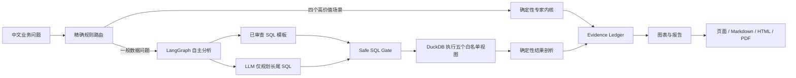

# ChainLens 链见

ChainLens 是一个面向智能制造产业的数据要素应用。它把工商登记、招投标、融资、股权和资质五类公开数据融合起来，回答三个实际问题：

1. 哪些企业有真实经营痕迹，却在融资数据里“看不见”？
2. 哪些资质正在到期，可能让企业错过投标或政策申报？
3. 哪些企业、区域和行业是产业协作网络的关键节点，哪里存在“企业多但交易弱”的空转预警？

它不是让大模型凭空写一份行业报告。数字、排名、筛选和指数全部来自安全 SQL 或确定性 Python 内核；模型只为长尾问题规划 SQL，不能直接填写报告数字。常见问题和四个专家场景没有模型 Key 也能运行，所有结论都能回到安全 SQL、结果表和证据链。

## 为什么有社会价值

公开数据里，融资记录只覆盖少数企业，招投标和资质记录却能呈现企业的真实经营痕迹。ChainLens 把这些痕迹加工成可核验的线索，帮助园区、银行、担保机构和企业服务部门更早发现“有能力但缺少标签”的中小企业，也帮助企业减少资质漏续期造成的经营损失。

当前本地数据底座包含约 1.76 万家企业、约 59 万条招投标记录。数据不进入
Git；本地可以通过 Excel 重建 DuckDB，线上 API 使用只读的 `znjz` MySQL，
启动时物化五个分析视图到内存 DuckDB。

## 当前能力

- 融资可见性：OCS 经营性信用分、融资缺口、隐形冠军候选名单
- 资质悬崖：区分年度制度性到期与多年期真实失效，生成未来 12 个月提醒清单
- 产业网络：从同一招投标公告重建供需、协作、竞争关系
- 区域体检：区县产业健康指数、行业空转预警、成立和招投标趋势
- 自主分析：自然语言问题生成受控只读 SQL，执行后自动形成结论、图表和报告
- 自由问数：支持聚合、排序、跨视图 JOIN、反向筛选和多指标问题，不要求先选固定场景
- 双路径规划：十类常见问题使用已审查 SQL 模板，长尾问题才调用火山方舟，失败时可切换 DeepSeek
- SQL 安全门：仅允许五个脱敏视图、单条 `SELECT/WITH`、显式字段和最多 500 行
- 可审计交付：证据账本、Markdown、HTML、PDF、PNG 图表
- 离线优先：默认使用本地 DuckDB，不依赖 MySQL 或模型 Key

## 快速开始

```powershell
cd G:\chainlens
python -m pip install -r requirements.txt
python scripts\build_warehouse.py --raw-dir G:\text2sql_0705
python scripts\run_pipeline.py
```

运行四个标准问题后，报告在 `data\outputs\acceptance_YYYYMMDD\`。每个场景包含 Markdown、HTML、PDF 和图表。

运行自主分析十问验收：

```powershell
python scripts\run_autonomous_acceptance.py
```

它会验证经营状态、行业 Top、融资轮次、招投标年度、资质年份、地区分布、成立趋势、对外投资、注册资本区间和企业详情，并保存每题的原始 SQL、安全 SQL、结果、结论、图表、证据、trace、Markdown、HTML 和 PDF。

## 自由问数

默认首页就是自由问数工作台。可以直接输入自然语言，也可以点击输入框下方的
复合问题示例。以下问题已经用真实 `znjz` MySQL + 火山方舟跑通：

```text
统计不同经济类型企业的平均注册资本和企业数量，按企业数量降序
找出成立超过20年且有融资记录的企业，显示企业名称、成立日期和融资次数，按融资次数排序前20名
统计各成立年份的企业数量，以及其中有招投标记录的企业数量
查询2020年以来有融资记录但没有招投标记录的企业，显示企业名称和最近融资年份
```

自由问数的工作方式是：

1. 规则路由先判断是否应进入融资、资质、产业网络或区域专家内核。
2. 其他合规问题进入 LangGraph，自主读取五个视图的 Schema，由模型只规划 SQL。
3. SQL 必须经过只读、单语句、视图白名单、显式字段和 LIMIT 校验。
4. DuckDB 执行安全 SQL 后，系统从真实结果生成结论、图表、证据和报告。

因此它是“限定数据域内的自由问数”，不是任意 SQL 执行器。当前边界是：

- 只能查询 `v_enterprise`、`v_bidding`、`v_financing`、`v_equity`、`v_qualification`；
- 一次问题生成一条只读 SQL，不支持跨轮次记忆式对话；
- 不能写入数据库、读取密钥、访问白名单外表或调用文件系统；
- 每次最多执行并返回 500 行，页面默认展示前 12 行；
- 问题超出当前 Schema、模型未配置或 SQL 修复失败时，明确返回失败，不编造答案。

启动交互页面：

```powershell
streamlit run app\streamlit_app.py
```

## 测试和安全检查

```powershell
python -m pytest -q
python scripts\check_security.py
python scripts\run_public_acceptance.py --include-long-tail --include-freeform
python scripts\test_public_frontend.py
```

当前验收包含四个真实内核和 Agent 交付链路。没有证据、没有数据或包含敏感配置的结果不会被当成合格报告。
公网验收共 15 个问题：十个确定性模板、一个普通长尾问题、四个复合自由问数问题。

## API 使用

```http
POST /api/query
Content-Type: application/json

{"question":"按注册资本区间统计企业数量"}
```

成功响应包含 `sql`、`safe_sql`、`safety`、`tables`、`findings`、`charts`、`evidence`、`trace` 和 `report_markdown`。SQL 连续两次修复失败返回结构化 `422`；长尾问题缺少模型配置返回 `503`，不会用固定报告冒充答案。

## 架构



详细架构见 [docs/ARCHITECTURE.md](docs/ARCHITECTURE.md)，自主分析设计见 [docs/AUTONOMOUS_ANALYSIS_DESIGN.md](docs/AUTONOMOUS_ANALYSIS_DESIGN.md)，指标口径见 [docs/METHODOLOGY.md](docs/METHODOLOGY.md)，竞赛立意见 [docs/COMPETITION_BRIEF.md](docs/COMPETITION_BRIEF.md)，交接入口见 [docs/AGENT_HANDOFF.md](docs/AGENT_HANDOFF.md)。

## 公网部署

当前静态前端已部署到：

<https://gaaiyun.github.io/chainlens/>

实时 API 已部署到：

<https://chainlens-production.up.railway.app/>

`GET /health` 用于查看进程和数据初始化状态；`GET /ready` 只有真实 MySQL
数据完成物化、API 可以查询时才返回 200。部署期间旧实例会继续服务，避免慢速
数据加载让公网入口直接中断。

API 采用 FastAPI，可部署到 Railway。仓库根目录的 `railway.toml` 已固定启动
命令和 `/ready` 就绪检查。部署时通过 Railway Variables 连接已有的只读
`znjz` MySQL，服务启动后会缓存五个分析视图；不需要把被 Git 忽略的
DuckDB 或 Excel 上传到仓库。

完整步骤见 [docs/RAILWAY_DEPLOY.md](docs/RAILWAY_DEPLOY.md)。

## 数据和合规边界

原始 Excel、DuckDB、Parquet 和报告产物默认被 `.gitignore` 排除。项目只使用当前数据集允许的分析视图，不把密钥、数据库密码、企业隐私字段或外部推断写入仓库。OCS 是公开数据线索分，不是征信分；任何授信、投资、处罚或政策认定都必须人工复核。
