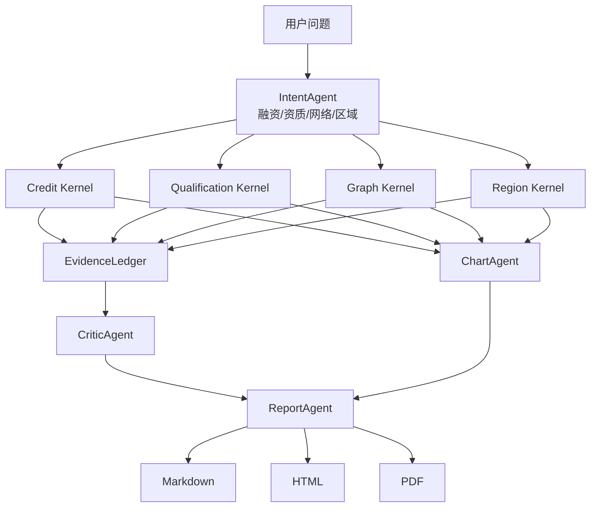

# 架构说明

## 设计目标

ChainLens 的核心不是“让模型多说几句”，而是把公共数据加工成可以复核、可以行动的数据产品。因此架构坚持三条边界：

- 计算和表达分离：指标由 `kernels/` 计算，报告层不得重新计算。
- 证据先于结论：每条进入报告的数字都必须关联 `Evidence`。
- 离线优先：默认只读 DuckDB，LLM 是未来的表达增强，不是运行前提。

## 执行流

## 代码边界

| 层 | 目录 | 责任 |
| --- | --- | --- |
| 数据底座 | `src/chainlens/warehouse` | Excel 标准化、Parquet、DuckDB 派生视图、只读访问 |
| 确定性内核 | `src/chainlens/kernels` | OCS、资质、网络、区域指标 |
| 证据 | `src/chainlens/evidence.py` | 证据 ID、SQL、命中行数、置信度、局限 |
| Agent 编排 | `src/chainlens/agents` | 路由、调用内核、质量门、产物编排 |
| 前端 | `app/streamlit_app.py` | 页面交互和下载，不复制业务逻辑 |
| 脚本 | `scripts` | 数据重建、标准问题验收、安全扫描 |

Agent 层目前采用显式规则和确定性内核。未来接入 LLM 时，LLM 只能承担问题澄清、证据解释和自然语言润色，不能直接修改 `Finding` 的数字或绕过 `quality_gate`。
