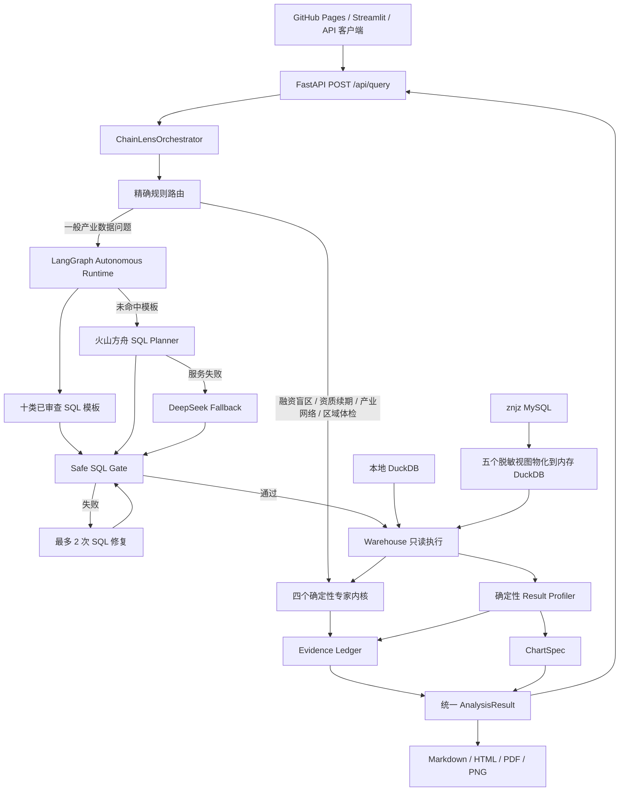
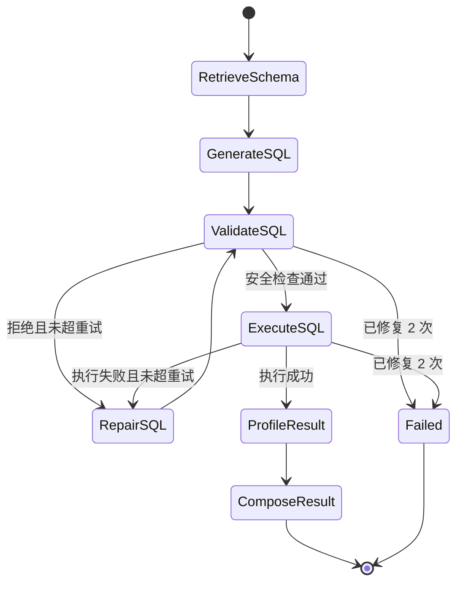

# 架构说明

## 设计底线

ChainLens 把公共数据加工成可以复核、可以行动的数据产品。架构保持四条边界：

- 模型不产生业务数字：LLM 只能规划 SQL，最终数字来自数据库执行或确定性内核。
- 证据先于结论：每条 `Finding` 必须绑定 `Evidence`，保存 SQL、行数、口径和局限。
- 数据访问集中治理：所有查询必须经过 `Warehouse`，自主查询还必须经过 Safe SQL Gate。
- 一套运行时：FastAPI、GitHub Pages 前端、Streamlit 和验收脚本调用同一个 `ChainLensOrchestrator`。

## 系统架构

## 自主分析状态图

常见问题优先命中确定性模板，因此不消耗模型额度，响应也更稳定。长尾问题才调用 OpenAI-compatible Provider。即便由模型规划，SQL 仍必须通过只读、单语句、视图白名单、显式字段和 `LIMIT 500` 检查后才能执行。

## 代码边界

| 层 | 位置 | 责任 |
| --- | --- | --- |
| 数据底座 | `src/chainlens/warehouse` | Excel 标准化、MySQL 只读接入、DuckDB 物化、查询白名单 |
| 确定性内核 | `src/chainlens/kernels` | OCS、资质、网络、区域指标 |
| 自主运行时 | `src/chainlens/agents/autonomous.py` | LangGraph、SQL 校验/修复、结果剖析 |
| 模型适配 | `src/chainlens/agents/llm.py` | 火山方舟、DeepSeek、延迟初始化和故障切换 |
| Schema 合同 | `src/chainlens/agents/schema_context.py` | 五个分析视图、字段口径、已审查 SQL 模板和提示词 |
| 证据合同 | `src/chainlens/evidence.py` | 证据 ID、SQL、命中行数、置信度和限制 |
| 统一编排 | `src/chainlens/agents/orchestrator.py` | 精确路由、专家内核、自主分支和产物编排 |
| 交付层 | `api_server.py`、`web/`、`app/` | API、页面交互、SQL trace 和报告下载，不复制计算逻辑 |
| 验收 | `tests/`、`scripts/run_autonomous_acceptance.py` | 单元、集成、真实十问、安全和浏览器回归 |

## 失败语义

- 空结果是成功结果：明确报告当前数据未命中，不扩展为现实世界结论。
- SQL 不安全或不可执行：最多修复两次，仍失败则停止交付并返回 `422`。
- 长尾问题缺少模型配置：返回 `503`，常见模板和专家内核不受影响。
- 数据库不可达：服务健康检查失败，不回退到伪造快照。
- 前端收到错误：清空旧实时结果，显示具体原因和“未产生结论”状态。

## 数据边界

自主 SQL 只能访问 `v_enterprise`、`v_bidding`、`v_financing`、`v_equity`、`v_qualification`。线上从只读 MySQL 拉取并物化到 DuckDB；本地从 Excel 构建 DuckDB。两种后端共享同一个视图合同和执行逻辑。
