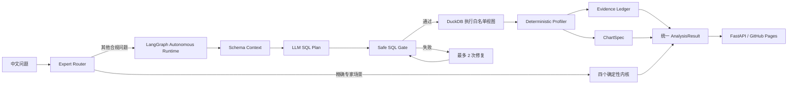

# ChainLens 受控自主分析设计

## 目标

让公开页面的自然语言输入真正回答用户问题，而不是把未知问题回退到固定总览。
自主分析必须继续遵守项目底线：模型不直接给出业务数字，所有结论来自数据库执行后的
确定性计算，并且能回放安全 SQL、结果表和证据链。

## 当前问题

自由问数的目标不是放开数据库，而是在五个脱敏分析视图内支持自然语言组合条件、
聚合、排序、JOIN 和反向筛选。第一版已经解决固定 overview 和关键词误路由问题，
但必须持续用复合问题验收，防止简单模板吞掉用户问题的一部分。

## 方案选择

### 方案 A：在 ChainLens 内增加受控自主分析分支（采用）

- 四个高价值专家内核继续保留。
- 不满足专家内核精确触发条件的问题进入 LangGraph 自主分析图。
- LLM 只生成结构化 SQL 计划和图表建议。
- SQL 经过白名单、只读、单语句、行数上限检查后才执行。
- 结论、证据和报告由结果表确定性生成。

优点是一套 API、一个部署、同一数据视图合同；缺点是 ChainLens 需要维护紧凑的
Schema 提示词和 Provider 抽象。

### 方案 B：ChainLens 代理上游 `text2sql-analysis` API（不采用）

可以复用完整 Runtime，但需要第二个公网服务、跨服务鉴权和两套部署状态，竞赛现场的
故障面更大。

### 方案 C：把上游仓库作为 Git 依赖安装（不采用）

减少复制代码，但上游包结构、Schema 相对路径和应用入口不是稳定的库接口，Railway
构建容易因仓库内部布局变化而失效。

## 架构

## 组件边界

### `agents/llm.py`

读取火山方舟或 DeepSeek 环境变量，使用 OpenAI-compatible SDK。API Key 缺失时返回明确
配置错误，不写日志。Provider 只暴露 `complete(messages)`。

### `agents/schema_context.py`

维护五个脱敏视图的紧凑字段字典、关系、口径和标准 SQL 示例。自主分析只能使用：

- `v_enterprise`
- `v_bidding`
- `v_financing`
- `v_equity`
- `v_qualification`

### `agents/autonomous.py`

LangGraph 节点固定为：

`retrieve_schema -> generate_sql -> validate_sql -> execute_sql -> repair_sql(optional) -> profile_result -> compose_result`

最大修复次数为 2。输出统一转换为 `AnalysisResult`，`intent="autonomous"`。

### `warehouse/access.py`

继续作为唯一执行入口。自主 SQL 必须通过现有 `validate_sql()`；执行时自动补 `LIMIT 500`。
拒绝非 SELECT/WITH、多语句、写操作、白名单外对象和文件读写关键字。

### `api_server.py`

`POST /api/query` 合同增加顶层 `sql`、`safe_sql`、`safety`。自主分析失败返回结构化 422，
数据库或模型服务不可达返回 503，不静默替换成固定报告。

### `web/`

实时结果区展示：回答标题、确定性结论、图表、结果表、证据链，以及可展开的“SQL 与执行轨迹”。
固定四场景快照仍可浏览，但任意问题默认进入 API 自动路由。

## 路由规则

只有高特异性问题进入专家内核：

- 融资内核：融资盲区、授信线索、隐形冠军、OCS。
- 资质内核：续期、到期、过期、资质悬崖。
- 网络内核：产业协作网络、关键节点、共现、供应链关系。
- 区域内核：产业健康指数、行业空转、区县体检。

一般融资轮次、注册资本、成立趋势、经营状态、行业 Top、地区分布、企业详情等问题进入
自主分析，避免关键词误路由；如果问题同时出现两个数据域词，例如“成立年份 + 招投标
企业数”，必须绕过单域模板交给 LLM 规划跨视图 SQL，避免只回答前半句。

显式的 `Top N` / `前 N 名` 会由安全门强制写入最终 SQL 的 `LIMIT N`，不能被模型
遗漏或被默认的 `LIMIT 500` 覆盖。

## 确定性结论规则

模型不编写最终数字结论。Profiler 根据执行结果生成：

- 空结果：明确“没有匹配记录”，不生成业务推断。
- 单值：报告指标名和值。
- 分类/排名：报告结果行数、Top 1 类别和值；必要时报告末位，不做因果推断。
- 时间序列：报告首期、末期和确定性变化值。
- 明细：报告返回条数和筛选范围，不把样本外结论扩大到总体。

每条 Finding 都绑定一条 Evidence，Evidence 保存安全 SQL、行数、值和限制说明。

## 错误处理

- LLM 返回非 JSON：进入修复，最多 2 次。
- SQL 安全拒绝：把安全错误反馈给修复节点，不执行。
- SQL 执行失败：把数据库错误和 Schema 重新提供给修复节点。
- 空结果：成功返回空结果报告。
- LLM/数据库连续失败：返回可读错误、原 SQL、安全报告和 trace。

## 安全与运维

- Key 只存 Railway Variables。
- CORS 继续限制为 GitHub Pages origin。
- 结果最多返回 100 行，执行上限 500 行。
- 自主分析不访问原始表和个人字段。
- 日志只记录节点、耗时、行数和错误类型，不记录 Key、密码或完整连接串。
- Railway 试用额度需在正式竞赛前升级或补充额度。

## 验收标准

1. 十个标准问题均返回与问题匹配的 SQL、结果、图表和报告。
2. 四个专家场景仍走确定性内核，原有结果不回归。
3. DROP、多语句、白名单外表和提示注入无法执行。
4. 错误 SQL 能修复；两次失败后明确返回错误。
5. 空结果不编造结论。
6. 公网桌面和手机能展开 SQL、查看图表、证据和结果表。
7. `pytest`、安全扫描、Playwright、本地真实 MySQL和 Railway 公网验收全部通过。

## 自由问数回归问题

每次修改路由、Schema 提示词或 SQL 安全门，都至少复测以下四类问题：

| 类型 | 目的 | 必须检查 |
| --- | --- | --- |
| 多指标聚合 | 平均值 + 数量 + 排序 | 输出列和排序条件对应问题 |
| 显式 Top N | 用户数量限制 | 最终 `safe_sql` 是 `LIMIT N` |
| 跨视图 JOIN | 成立年份 + 招投标企业数 | 不得回退单表模板 |
| 反向筛选 | 有融资但无招投标 | 不得误判为“无融资”专家场景 |
