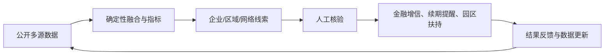

# 数据要素竞赛立意

## 项目名称

**链见 ChainLens：让有经营能力但缺少金融标签的中小制造企业被看见。**

## 要解决的真实问题

中小制造企业的经营能力分散在工商登记、招投标、资质、股权等公共数据中。金融机构和政策部门通常能看到融资或名录，却不容易把“持续中标、具备资质、保持经营”的信号拼起来。结果是企业真实能力存在，但数据画像不完整，形成“数据黑户”。

## 数据要素加工方式

项目不是简单拼接五张表，而是完成三次增值：

1. 以 `eid` 为统一主体键，把多源事实聚合成企业经营画像。
2. 把招投标公告从事件记录加工成产业协作网络。
3. 把公开记录转成 OCS、资质提醒和区域健康等可复用数据产品，每个数字保留证据链和口径。

## 创新点

- “计算与表达分离”的可信 Agent 架构：模型不能替换确定性结果。
- 融资盲区识别：用真实中标和资质信号发现潜在增信企业，而不是只按注册资本排序。
- 资质悬崖拆分：避免把年度制度性到期误报成企业风险。
- 公告共现网络：从单条招投标记录提炼供需、协作、竞争结构。
- 缺失数据也被显式管理：报告写清没有什么，建议下一步补采什么。

## 社会价值闭环

项目不承诺“自动决策”，而是缩短从公开数据到可核验行动线索的距离，降低中小企业被忽略的概率。
