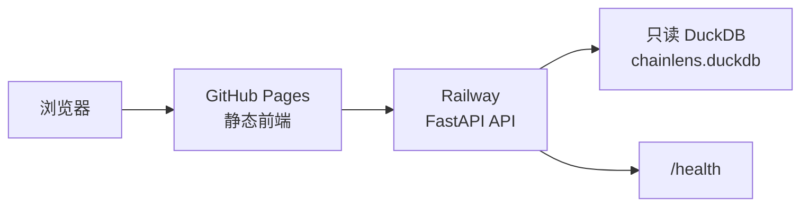

# Railway 部署说明

本文说明如何把 ChainLens 的 Python API 部署到 Railway，并让已经上线的
GitHub Pages 前端调用它。

## 结论先说

Railway 适合承载 ChainLens 的 FastAPI API：

- 可以从 GitHub 仓库直接创建服务；
- 能为服务生成公网 HTTPS 域名；
- 能通过环境变量保存配置；
- 可以用 `/health` 做部署健康检查；
- 适合当前“静态前端 + Python API”的拆分方式。

当前推荐架构：



GitHub Pages 继续负责前端，Railway 只负责 API。不要在 Railway 的
Developer/OAuth 页面创建 OAuth App；普通的 GitHub 仓库部署不需要填写
OAuth 回调地址。

## 部署前必须解决的数据问题

API 启动时需要读取：

```text
data/warehouse/chainlens.duckdb
```

这个文件包含真实实验数据，已被 `.gitignore` 排除，不会进入 GitHub 仓库。
因此只把代码部署到 Railway，页面可能能打开，但查询会因没有数据底座而失败。

推荐按以下优先级选择数据方案：

1. **推荐：Railway Volume + 一次性构建数据**
   - 在 Railway 服务挂载持久化 Volume。
   - 通过安全的临时方式把原始 Excel 传到服务的挂载目录。
   - 运行 `python scripts/build_warehouse.py --raw-dir <目录>`。
   - 确认生成 `chainlens.duckdb` 后，再删除原始 Excel。
   - 不把原始 Excel、DuckDB 或数据库密码提交到 GitHub。

2. **适合稳定发布：对象存储或 Release Asset**
   - 把经过脱敏、压缩和校验的只读 DuckDB 放在受控对象存储。
   - Railway 启动时下载到 Volume。
   - 下载地址、校验值和访问凭据通过 Railway Variables 配置。
   - 当前本地 DuckDB 约 137 MB，不应直接提交到普通 Git 历史。

3. **后续演进：远程 MySQL 适配器**
   - Railway 通过变量连接远程 MySQL。
   - 需要给 ChainLens 仓库增加 MySQL 只读访问层，并保持现有确定性内核的
     字段和口径不变。
   - 不能只把 MySQL 连接字符串填进 Railway，就假设当前 DuckDB 内核可以直接运行。

在数据方案完成前，Railway 只能作为 API 部署演练，不能作为可交付的线上
查询服务。

## Railway 控制台操作

1. 打开 Railway，进入项目列表。
2. 选择 `New Project`，再选择从 GitHub 仓库部署。
3. 授权 Railway 读取 `gaaiyun/chainlens`，选择 `main` 分支。
4. Railway 会读取仓库根目录的 `railway.toml`：

```toml
[build]
builder = "NIXPACKS"

[deploy]
startCommand = "uvicorn api_server:app --host 0.0.0.0 --port $PORT"
healthcheckPath = "/health"
healthcheckTimeout = 300
restartPolicyType = "ON_FAILURE"
restartPolicyMaxRetries = 10
```

5. 在服务的 `Variables` 中配置：

```text
CHAINLENS_ALLOWED_ORIGINS=https://gaaiyun.github.io
```

如果使用自定义前端域名，把多个来源用英文逗号分隔，例如：

```text
CHAINLENS_ALLOWED_ORIGINS=https://gaaiyun.github.io,https://app.example.com
```

6. 在 `Settings -> Networking` 中生成 Railway 公网域名。
7. 用浏览器检查：

```text
https://你的-railway-域名/health
```

正常时应返回：

```json
{"status":"ok","engine":"deterministic-kernels"}
```

8. 记录 Railway 域名后，修改本仓库的 `web/config.js`：

```javascript
window.CHAINLENS_API_URL = "https://你的-railway-域名";
```

推送后等待 GitHub Pages workflow 完成，再从
`https://gaaiyun.github.io/chainlens/` 发起真实查询。

## 变量和密钥规则

Railway Variables 只放运行时配置，不写进仓库文件、报告、截图或日志。

当前 API 不需要 LLM Key 才能完成核心分析。若后续加入模型层，模型 Key
也只通过 Railway Variables 注入，代码中只读取变量名，不出现真实值。

数据库账号必须是只读账号，且只授予目标数据库和必要视图的权限。不要把
BT 面板管理员密码、MySQL root 密码或 API Key 作为 GitHub Secret 之外的
普通配置提交。

## 当前线上边界

- 前端：`https://gaaiyun.github.io/chainlens/`
- API 入口：`api_server.py`
- API 健康检查：`GET /health`
- API 查询：`POST /api/query`
- 本地数据底座：`data/warehouse/chainlens.duckdb`
- Railway 配置：仓库根目录 `railway.toml`
- Railway 公网域名：尚未创建

## 上线验收

部署完成后按顺序验证：

1. Railway 部署日志没有启动异常。
2. `/health` 返回 HTTP 200。
3. 前端 Network 请求指向 Railway 域名，而不是空地址。
4. `POST /api/query` 返回 `findings`、`tables`、`evidence` 和
   `report_markdown`。
5. 一个融资问题和一个区域问题都能返回非空证据。
6. 浏览器控制台没有 CORS 错误。
7. Railway Variables 没有出现在页面、报告或 Git diff。

## 常见误区

- 不要在 Developer/OAuth 页面填写部署回调地址；那是给第三方 OAuth 应用
  使用的，不是 Railway 部署配置。
- 不要把 `chainlens.duckdb` 直接提交到 GitHub 普通仓库。
- 不要把 `allow_origins` 长期保持为 `*` 后再允许写操作；当前 API 是只读
  查询，但生产环境仍应限制到实际前端域名。
- 不要用“页面能打开”代替“真实查询已通过”；必须同时验证数据底座、
  API、CORS 和四类场景。
