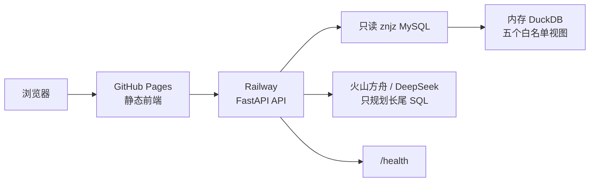

# Railway 部署说明

本文说明如何把 ChainLens 的 Python API 部署到 Railway，并让已经上线的
GitHub Pages 前端调用它。

## 结论先说

Railway 适合承载 ChainLens 的 FastAPI API：

- 可以从 GitHub 仓库直接创建服务；
- 能为服务生成公网 HTTPS 域名；
- 能通过环境变量保存配置；
- 可以用 `/health` 做部署健康检查；
- 适合当前“静态前端 + Python API”的拆分方式。

当前推荐架构：



GitHub Pages 继续负责前端，Railway 只负责 API。不要在 Railway 的
Developer/OAuth 页面创建 OAuth App；普通的 GitHub 仓库部署不需要填写
OAuth 回调地址。

## 数据来源和线上运行方式

当前 `znjz` MySQL 已经开放远程访问，Railway 不需要上传
`chainlens.duckdb`。API 启动时会：

1. 用 Railway Variables 中的只读 MySQL 账号附加 `znjz`；
2. 读取五个兼容分析视图；
3. 把五个白名单视图物化到内存 DuckDB；
4. 让四个确定性内核只查询本地缓存视图。

这样既使用了你已经维护的数据源，也避免复杂 CTE 直接在远程 MySQL
连接上执行。实际本地验收的启动缓存时间约 7 秒，五个视图行数为：

```text
v_enterprise       17,576
v_bidding         576,690
v_financing           267
v_equity            6,757
v_qualification   14,486
```

本地 `data/warehouse/chainlens.duckdb` 仍然保留，作用是离线复现和没有
远程数据库时的开发测试；它被 `.gitignore` 排除，不会进入 GitHub。

如果以后不再允许公网访问 MySQL，再切换到 Railway Volume + DuckDB 快照
或受控对象存储，不需要改四个确定性内核。

## Railway 控制台操作

1. 打开 Railway，进入项目列表。
2. 选择 `New Project`，再选择从 GitHub 仓库部署。
3. 授权 Railway 读取 `gaaiyun/chainlens`，选择 `main` 分支。
4. Railway 会读取仓库根目录的 `railway.toml`：

```toml
[build]
builder = "NIXPACKS"

[deploy]
startCommand = "uvicorn api_server:app --host 0.0.0.0 --port $PORT"
healthcheckPath = "/health"
healthcheckTimeout = 300
restartPolicyType = "ON_FAILURE"
restartPolicyMaxRetries = 10
```

5. 在服务的 `Variables` 中配置：

```text
CHAINLENS_ALLOWED_ORIGINS=https://gaaiyun.github.io
DB_HOST_SCENARIO_1_3=<MySQL 主机>
DB_PORT_SCENARIO_1_3=3306
DB_NAME_SCENARIO_1_3=<数据库名>
DB_USER_SCENARIO_1_3=<只读用户名>
DB_PASSWORD_SCENARIO_1_3=<数据库密码>
LLM_PROVIDER=volcengine_ark
VOLCENGINE_ARK_BASE_URL=https://ark.cn-beijing.volces.com/api/coding/v3
VOLCENGINE_ARK_MODEL=glm-5.2
VOLCENGINE_ARK_API_KEY=<火山方舟 API Key>
DEEPSEEK_BASE_URL=https://api.deepseek.com
DEEPSEEK_MODEL=deepseek-chat
DEEPSEEK_API_KEY=<备用 DeepSeek API Key>
LLM_TIMEOUT_SECONDS=90
```

如果使用自定义前端域名，把多个来源用英文逗号分隔，例如：

```text
CHAINLENS_ALLOWED_ORIGINS=https://gaaiyun.github.io,https://app.example.com
```

6. 在 `Settings -> Networking` 中生成 Railway 公网域名。
7. 用浏览器检查：

```text
https://你的-railway-域名/health
```

正常时应返回：

```json
{"status":"ok","engine":"controlled-agent-runtime","database":"mysql"}
```

8. 记录 Railway 域名后，修改本仓库的 `web/config.js`：

```javascript
window.CHAINLENS_API_URL = "https://你的-railway-域名";
```

推送后等待 GitHub Pages workflow 完成，再从
`https://gaaiyun.github.io/chainlens/` 发起真实查询。

## 变量和密钥规则

Railway Variables 只放运行时配置，不写进仓库文件、报告、截图或日志。

四个专家内核和十类常见问题不需要 LLM Key。未命中模板的长尾问题需要模型规划 SQL；
主模型不可用时才调用 DeepSeek。模型 Key 只通过 Railway Variables 注入，代码、
报告、截图和命令输出中都不出现真实值。推荐用 CLI 的标准输入写入密钥：

```powershell
$secret | railway variable set VOLCENGINE_ARK_API_KEY --stdin
```

数据库账号必须是只读账号，且只授予目标数据库和必要视图的权限。不要把
BT 面板管理员密码、MySQL root 密码或 API Key 作为 GitHub Secret 之外的
普通配置提交。

## 当前线上边界

- 前端：`https://gaaiyun.github.io/chainlens/`
- API 入口：`api_server.py`
- API 健康检查：`GET /health`
- API 查询：`POST /api/query`
- 线上数据源：Railway Variables 指向的只读 `znjz` MySQL
- 离线数据底座：`data/warehouse/chainlens.duckdb`
- Railway 配置：仓库根目录 `railway.toml`
- Railway 项目：`perceptive-stillness / production / chainlens`
- Railway 公网域名：`https://chainlens-production.up.railway.app`
- GitHub Pages：`https://gaaiyun.github.io/chainlens/`

当前部署已完成真实 MySQL 四场景和自主分析十问验收。Railway 账户仍处于试用额度，竞赛
正式展示前要检查剩余额度或升级套餐，避免服务因额度耗尽暂停。

## 上线验收

部署完成后按顺序验证：

1. Railway 部署日志没有启动异常，并且能看到 MySQL 缓存初始化完成。
2. `/health` 返回 HTTP 200。
3. `/health` 的 `database` 返回 `mysql`。
4. 前端 Network 请求指向 Railway 域名，而不是空地址。
5. `POST /api/query` 返回 `sql`、`safe_sql`、`safety`、`findings`、`tables`、
   `charts`、`evidence`、`trace` 和 `report_markdown`。
6. 四个专家问题、十个标准自主问题和一个长尾模型问题都返回非空证据。
7. 浏览器控制台没有 CORS 错误。
8. SQL 详情可展开，报告可下载，失败响应不会保留旧结果。
9. Railway Variables 没有出现在页面、报告或 Git diff。

## 常见误区

- 不要在 Developer/OAuth 页面填写部署回调地址；那是给第三方 OAuth 应用
  使用的，不是 Railway 部署配置。
- 不要把 `chainlens.duckdb` 或六张 Excel 直接提交到 GitHub 普通仓库。
- 不要把 `allow_origins` 长期保持为 `*` 后再允许写操作；当前 API 是只读
  查询，但生产环境仍应限制到实际前端域名。
- 不要用“页面能打开”代替“真实查询已通过”；必须同时验证 MySQL
  连通性、缓存视图、API、CORS、四个专家场景、十个标准问题和一个长尾问题。
